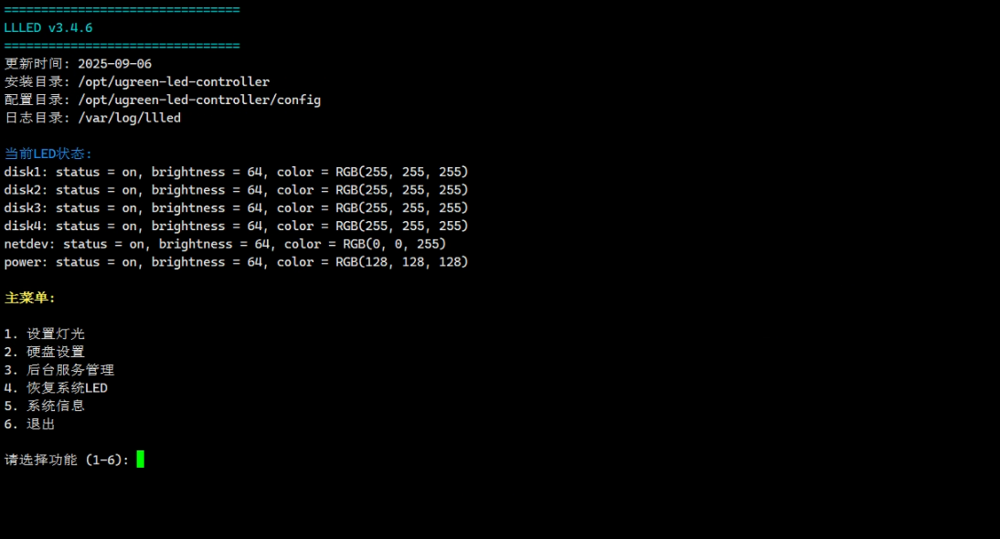
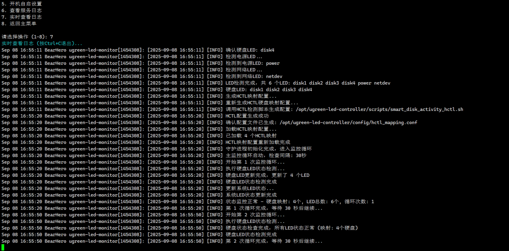

# LLLED - 绿联 LED 智能控制系统

> 🚀 **专业的绿联 NAS LED 控制解决方案**  
> 支持 DX4600 Pro、DX4700+、DXP4800+ 等设备的智能 LED 控制和硬盘状态监控

[](https://opensource.org/licenses/MIT)
[](https://github.com/BearHero520/LLLED)
[](https://github.com/BearHero520/LLLED)
[](https://github.com/BearHero520/LLLED)

## ✨ 核心特性

### 🎯 智能硬盘监控

-   **HCTL 智能映射** - 自动检测硬盘位置和状态
-   **多状态显示** - 活动/空闲/休眠/故障硬盘不同颜色显示
-   **实时监控** - 实时反映硬盘读写活动状态
-   **故障预警** - 硬盘异常时自动闪烁提醒

### 🎨 丰富的视觉效果

-   **15 种预设模式** - 从实用到装饰应有尽有
-   **彩虹跑马灯** - 炫酷的 RGB 渐变效果
-   **呼吸灯效果** - 柔和的亮度变化
-   **自定义颜色** - 支持 RGB 颜色完全自定义

### 🌙 人性化体验

-   **夜间模式** - 低亮度白光，不影响睡眠
-   **节能模式** - 仅保留电源指示灯
-   **定位模式** - 快速闪烁便于机柜定位
-   **静音模式** - 完全关闭所有 LED

### ⚡ 便捷操作

-   **一键安装** - 无需复杂配置，30 秒完成安装
-   **命令行支持** - 丰富的 CLI 命令选项
-   **交互界面** - 直观的菜单式操作
-   **完全卸载** - 支持保留配置选项

## 🔧 支持设备

| 设备型号            | 支持状态    | 说明     |
| ------------------- | ----------- | -------- |
| UGREEN DX4600 Pro   | ✅ 完全支持 | 官方测试 |
| UGREEN DX4700+      | ✅ 完全支持 | 社区验证 |
| UGREEN DXP2800      | ✅ 完全支持 | 社区验证 |
| UGREEN DXP4800      | ✅ 完全支持 | 社区验证 |
| UGREEN DXP4800 Plus | ✅ 完全支持 | 主要支持 |
| UGREEN DXP6800 Pro  | ✅ 完全支持 | 社区验证 |
| UGREEN DXP8800 Plus | ✅ 完全支持 | 社区验证 |

## 💻 系统要求

-   **操作系统**: Linux (Debian/Ubuntu/TrueNAS/Proxmox 等)
-   **内核模块**: `i2c-dev` (自动加载)
-   **权限**: Root 权限
-   **硬件**: 绿联兼容设备

## 🚀 快速开始

### 一键安装 (推荐)

```bash
# 方法1: 使用 wget (推荐)
wget -O- "https://raw.githubusercontent.com/BearHero520/LLLED/main/quick_install.sh" | sudo bash

# 方法2: 使用 curl
curl -sSL "https://raw.githubusercontent.com/BearHero520/LLLED/main/quick_install.sh" | sudo bash
```

### 安装完成后立即使用

```bash
# 启动交互式控制面板 (需要root权限)
sudo LLLED

# 直接运行智能监控 (推荐)
sudo LLLED --smart-activity
```

## 🖼️ 功能展示

### 交互式控制面板

启动 `sudo LLLED` 后的主界面，提供直观的菜单选择：



### 智能监控效果

硬盘活动状态的实时 LED 显示效果：



### ⚡ 常用命令

```bash
# 核心功能 (需要root权限)
sudo LLLED                      # 交互式控制面板
sudo LLLED --smart-activity     # 智能硬盘活动监控 ⭐推荐
sudo LLLED --disk-status        # 基础硬盘状态显示
sudo LLLED --hctl-activity      # HCTL智能映射活动监控

# 灯光效果
sudo LLLED --rainbow            # 彩虹跑马灯效果
sudo LLLED --breathing          # 呼吸灯效果
sudo LLLED --flowing            # 流水灯效果
sudo LLLED --custom-modes       # 15种自定义模式菜单

# 实用模式
sudo LLLED --night-mode         # 夜间模式 (低亮度)
sudo LLLED --eco-mode           # 节能模式 (仅电源灯)
sudo LLLED --locate-mode        # 定位模式 (快速闪烁)
sudo LLLED --turn-off           # 关闭所有LED

# 配置和测试
sudo LLLED --configure          # 配置LED映射
sudo LLLED --test-mapping       # 测试LED映射
sudo LLLED --verify-detection   # 验证硬盘检测
sudo LLLED --help              # 显示完整帮助

# 状态查看
sudo LLLED --status        # 查看当前LED状态
sudo LLLED --logs          # 查看运行日志
sudo LLLED --disk-info     # 查看硬盘HCTL信息
```

## 📁 项目结构

```
LLLED/
├── 📄 ugreen_led_controller.sh      # 主控制脚本
├── 📄 quick_install.sh              # 一键安装脚本
├── 📄 uninstall.sh                  # 卸载脚本
├── 📄 verify_detection.sh           # 硬盘检测验证
├── 📄 quick_led_test.sh             # LED快速测试
├── 📄 ugreen_leds_cli               # LED控制核心程序
├── 📂 config/
│   ├── global_config.conf           # 全局配置
│   ├── led_mapping.conf             # LED映射配置
│   ├── disk_mapping.conf            # 硬盘映射配置
│   └── hctl_mapping.conf            # HCTL映射配置
├── 📂 scripts/
│   ├── smart_disk_activity_hctl.sh  # HCTL智能监控
│   ├── disk_status_leds.sh          # 硬盘状态显示
│   ├── custom_modes.sh              # 自定义模式集合
│   ├── rainbow_effect.sh            # 彩虹效果
│   ├── led_test.sh                  # LED测试
│   ├── led_mapping_test.sh          # 映射测试
│   ├── configure_mapping_optimized.sh # 映射配置
│   ├── led_daemon.sh                # LED守护进程
│   └── turn_off_all_leds.sh         # 关闭所有LED
└── 📂 systemd/
    └── ugreen-led-monitor.service   # 系统服务文件
```

## 🎯 核心功能详解

### 智能硬盘监控

**HCTL 智能映射**

-   自动检测硬盘的 HCTL (Host:Channel:Target:Lun) 信息
-   智能匹配硬盘位置与 LED 位置
-   支持热插拔设备的动态检测

**多状态显示**

-   🟢 **活动状态** - 高亮度绿色 (RGB: 0,255,0)
-   🟡 **空闲状态** - 中等亮度黄色 (RGB: 255,255,0)
-   🔵 **休眠状态** - 低亮度蓝色 (RGB: 0,0,255)
-   🔴 **故障状态** - 闪烁红光 (RGB: 255,0,0)

### 15 种自定义模式

**硬盘状态模式**

1. 智能活动监控 - 根据 I/O 活动显示
2. 简单状态显示 - 仅显示健康状态
3. 温度监控模式 - 根据温度变色
4. 负载监控模式 - 根据磁盘负载显示

**装饰效果模式** 5. 呼吸灯效果 - 缓慢明暗变化 6. 流水灯效果 - LED 依次点亮 7. 闪烁模式 - 同步闪烁 8. 渐变彩虹 - RGB 颜色循环

**实用功能模式** 9. 夜间模式 - 低亮度白光 10. 定位模式 - 快速闪烁定位 11. 节能模式 - 仅电源灯亮 12. 静音模式 - 关闭所有 LED

**自定义选项** 13. 自定义颜色 - RGB 颜色设置 14. 自定义亮度 - 亮度级别调整 15. 自定义闪烁 - 闪烁频率设置

## 🔧 安装与配置

### 一键安装过程

1. **环境检查** - 检测系统兼容性和权限
2. **依赖下载** - 下载 ugreen_leds_cli 二进制文件
3. **文件部署** - 复制所有脚本到 `/opt/ugreen-led-controller/`
4. **权限设置** - 设置正确的执行权限
5. **命令链接** - 创建 `LLLED` 全局命令
6. **模块加载** - 自动加载 i2c-dev 模块
7. **配置初始化** - 创建默认配置文件

### 手动安装 (高级用户)

```bash
# 1. 创建安装目录
sudo mkdir -p /opt/ugreen-led-controller

# 2. 下载LED控制程序
sudo wget -O /opt/ugreen-led-controller/ugreen_leds_cli \
    https://github.com/miskcoo/ugreen_leds_controller/releases/download/v0.1-debian12/ugreen_leds_cli
sudo chmod +x /opt/ugreen-led-controller/ugreen_leds_cli

# 3. 克隆项目
git clone https://github.com/BearHero520/LLLED.git
cd LLLED

# 4. 复制文件
sudo cp -r * /opt/ugreen-led-controller/
sudo chmod +x /opt/ugreen-led-controller/*.sh
sudo chmod +x /opt/ugreen-led-controller/scripts/*.sh

# 5. 创建命令链接
sudo ln -sf /opt/ugreen-led-controller/ugreen_led_controller.sh /usr/local/bin/LLLED

# 6. 加载I2C模块
sudo modprobe i2c-dev
```

### 配置文件说明

**全局配置** (`config/global_config.conf`)

```bash
# 基础设置
LED_BRIGHTNESS=64
SLEEP_INTERVAL=1
DEBUG_MODE=false

# 默认模式
DEFAULT_MODE="smart_activity"
AUTO_START=false
```

**LED 映射配置** (`config/led_mapping.conf`)

```bash
# LED位置映射
POWER_LED=0
NETDEV_LED=1
DISK1_LED=2
DISK2_LED=3
DISK3_LED=4
DISK4_LED=5
```

**HCTL 映射配置** (`config/hctl_mapping.conf`)

```bash
# HCTL到LED的映射关系
# 格式: HCTL=LED_NAME
2:0:0:0=disk1
2:0:1:0=disk2
2:0:2:0=disk3
2:0:3:0=disk4
```

## 🔄 系统服务

### 安装系统服务

```bash
# 自动安装服务 (推荐)
sudo LLLED --install-service

# 手动启动服务
sudo systemctl start ugreen-led-monitor.service
sudo systemctl enable ugreen-led-monitor.service

# 查看服务状态
sudo systemctl status ugreen-led-monitor.service
```

### 服务管理

```bash
# 启动服务
sudo systemctl start ugreen-led-monitor.service

# 停止服务
sudo systemctl stop ugreen-led-monitor.service

# 重启服务
sudo systemctl restart ugreen-led-monitor.service

# 查看服务日志
sudo journalctl -u ugreen-led-monitor.service -f
```

## 🔍 故障排除

### 常见问题及解决方案

**问题 1: 命令未找到**

```bash
# 解决方案
sudo ln -sf /opt/ugreen-led-controller/ugreen_led_controller.sh /usr/local/bin/LLLED
```

**问题 2: LED 不亮或反应异常**

```bash
# 诊断步骤
sudo LLLED --verify-detection    # 验证硬盘检测
sudo LLLED --test-mapping        # 测试LED映射
sudo LLLED --status              # 查看LED状态
```

**问题 3: 硬盘检测失败**

```bash
# 解决方案
lsblk -S -o NAME,HCTL            # 查看硬盘HCTL信息
sudo LLLED --configure           # 重新配置映射
```

**问题 4: I2C 设备未找到**

```bash
# 解决方案
sudo modprobe i2c-dev            # 加载I2C模块
sudo i2cdetect -l                # 检查I2C设备
```

**问题 5: 权限问题**

```bash
# 解决方案 - 确保使用root权限
sudo LLLED
```

### 诊断命令组合

```bash
# 完整诊断流程
sudo LLLED --status              # 1. 检查LED状态
sudo LLLED --disk-info           # 2. 检查硬盘信息
sudo LLLED --verify-detection    # 3. 验证硬盘检测
sudo LLLED --test-mapping        # 4. 测试LED映射
sudo LLLED --logs                # 5. 查看运行日志
```

### 性能优化

```bash
# 减少CPU使用率 - 调整检测间隔
sudo nano /opt/ugreen-led-controller/config/global_config.conf
# 修改: SLEEP_INTERVAL=3  (默认为1秒)

# 查看系统资源使用
top -p $(pgrep -f ugreen_led)
```

## 🗑️ 卸载

### 完全卸载

```bash
# 方法1: 使用安装目录的卸载脚本
sudo /opt/ugreen-led-controller/uninstall.sh

# 方法2: 直接下载卸载脚本
wget -O- https://raw.githubusercontent.com/BearHero520/LLLED/main/uninstall.sh | sudo bash

# 方法3: 通过LLLED命令卸载
sudo LLLED --uninstall
```

### 卸载选项

-   **完全卸载** - 删除所有文件和配置
-   **保留配置卸载** - 删除程序文件，保留配置文件
-   **仅停用服务** - 停用服务，保留所有文件

## 📚 使用教程

### 新手快速上手

1. **安装**: 执行一键安装命令
2. **启动**: 运行 `sudo LLLED` 进入交互界面
3. **选择**: 选择 "智能硬盘活动监控" (推荐)
4. **享受**: 观察硬盘 LED 随活动状态变化

### 常用操作流程

```bash
# 1. 检查系统状态
sudo LLLED --status              # 查看LED状态
lsblk -S -o NAME,HCTL            # 查看硬盘映射

# 2. 启动监控
sudo LLLED --smart-activity      # 启动智能监控

# 3. 查看日志 (另开终端)
sudo LLLED --logs                # 查看运行日志

# 4. 如有问题进行诊断
sudo LLLED --verify-detection    # 验证硬盘检测
sudo LLLED --test-mapping        # 测试LED映射
```

### 进阶用户配置

1. **自定义映射**: 使用 `sudo LLLED --configure` 配置 LED 映射
2. **性能调优**: 调整配置文件中的检测频率
3. **服务模式**: 使用 `sudo LLLED --install-service` 实现开机自启
4. **个性化**: 使用 `sudo LLLED --custom-modes` 创建独特效果

## � 命令行参考

### LLLED 完整命令列表

```bash
# 基础功能
sudo LLLED                      # 交互式控制面板
sudo LLLED --smart-activity     # 智能硬盘活动监控 (推荐)
sudo LLLED --disk-status        # 基础硬盘状态显示
sudo LLLED --hctl-activity      # HCTL智能映射监控

# 灯光效果
sudo LLLED --rainbow            # 彩虹跑马灯
sudo LLLED --breathing          # 呼吸灯效果
sudo LLLED --flowing            # 流水灯效果
sudo LLLED --custom-modes       # 自定义模式菜单

# 实用模式
sudo LLLED --night-mode         # 夜间模式
sudo LLLED --eco-mode           # 节能模式
sudo LLLED --locate-mode        # 定位模式
sudo LLLED --turn-off           # 关闭所有LED

# 配置工具
sudo LLLED --configure          # 配置LED映射
sudo LLLED --test-mapping       # 测试LED映射
sudo LLLED --verify-detection   # 验证硬盘检测

# 状态查看
sudo LLLED --status             # 查看当前LED状态
sudo LLLED --logs               # 查看运行日志
sudo LLLED --disk-info          # 查看硬盘HCTL信息

# 系统管理
sudo LLLED --install-service    # 安装systemd服务
sudo LLLED --uninstall          # 卸载程序
sudo LLLED --version            # 显示版本信息
sudo LLLED --help               # 显示帮助信息
```

### ugreen_leds_cli 命令参考

```bash
# 基本语法
ugreen_leds_cli <led_name> -color R,G,B -brightness <0-255>

# 示例
ugreen_leds_cli disk1 -color 255,0,0 -brightness 128  # 红色，50%亮度
ugreen_leds_cli all -off                               # 关闭所有LED
ugreen_leds_cli all -status                            # 查看所有LED状态
```

## 🤝 社区与支持

### 获取帮助

-   **GitHub Issues**: [提交问题](https://github.com/BearHero520/LLLED/issues)
-   **讨论区**: [GitHub Discussions](https://github.com/BearHero520/LLLED/discussions)
-   **文档**: [在线文档](https://github.com/BearHero520/LLLED/wiki)

### 贡献代码

1. Fork 本项目
2. 创建功能分支: `git checkout -b feature/AmazingFeature`
3. 提交更改: `git commit -m 'Add some AmazingFeature'`
4. 推送分支: `git push origin feature/AmazingFeature`
5. 提交 Pull Request

### 反馈与建议

欢迎通过以下方式参与项目：

-   🐛 报告 Bug
-   💡 功能建议
-   📝 文档改进
-   🌐 多语言支持
-   📦 设备适配

## 📊 项目统计

-   **支持设备**: 7+ 款绿联 NAS 设备
-   **功能模式**: 15+ 种预设模式
-   **安装方式**: 一键安装，30 秒完成
-   **配置选项**: 可完全自定义
-   **社区用户**: 持续增长中

## � 更新日志

### v3.6.3 (2025-09-08)

-   ✨ 重构项目结构，优化用户体验
-   🐛 修复一键安装脚本的下载超时问题
-   🚀 改进 HCTL 智能映射算法
-   📝 完全重写使用文档

### v3.4.6 (2025-09-07)

-   ✨ 新增全功能集成版主控制器
-   🔧 优化配置文件结构
-   ⚡ 提升 LED 响应速度和稳定性

### v2.1.2 (2025-09-06)

-   ✨ 新增 HCTL 智能映射功能
-   🐛 修复 LED 映射错误问题
-   🚀 优化安装脚本，支持更多设备

## 📋 许可证

本项目基于 [MIT 许可证](LICENSE) 开源。

## 📖 参考资料

-   [绿联 DX4600 Pro LED 控制模块分析](https://blog.miskcoo.com/2024/05/ugreen-dx4600-pro-led-controller)
-   [miskcoo/ugreen_leds_controller](https://github.com/miskcoo/ugreen_leds_controller)
-   [TrueNAS LED 控制指南](https://gist.github.com/Kerryliu/c380bb6b3b69be5671105fc23e19b7e8)

---

<div align="center">

**🌟 如果这个项目对您有帮助，请点击 Star 支持我们！🌟**

[](https://star-history.com/#BearHero520/LLLED&Date)

_让您的绿联 NAS LED 更智能、更美观！_

</div>
